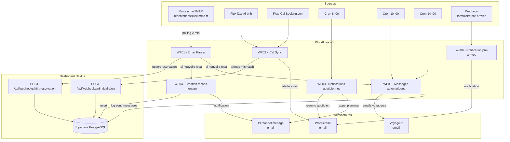

# n8n Workflows -- Dashboard Loc Immo

> Documentation complete des workflows d'automatisation n8n
> Projet : Dashboard Loc Immo | Version : 1.0 | Date : 2026-02-12

---

## 1. Vue d'ensemble

Les workflows n8n constituent le moteur d'automatisation du Dashboard Loc Immo. Ils gerent l'ingestion automatique des reservations, la synchronisation iCal, les notifications quotidiennes, la creation automatique des taches de menage et l'envoi de messages aux voyageurs.

### 1.1 Architecture globale

### 1.2 Tableau recapitulatif des workflows

| ID | Nom | Trigger | Frequence | Dependances |
|----|-----|---------|-----------|-------------|
| WF01 | Email Parser | IMAP Email Trigger | Polling 2 min | -> WF04, WF05 |
| WF02 | iCal Sync | Schedule (Cron) | Toutes les 30 min | Independant |
| WF03 | Notifications quotidiennes | Schedule (Cron) | Quotidien 8h00 CET | Independant |
| WF04 | Creation taches menage | Webhook (interne) | A la demande | Appele par WF01 |
| WF05 | Messages automatiques | Webhook + Schedule | Confirmation (webhook) + J-1 (10h) + J+0 (14h) | Appele par WF01 + crons |
| WF06 | Notification pre-arrivee | Webhook (externe) | A la demande | Appele par Next.js |

---

## 2. Credentials requises

Configurer les credentials suivantes dans n8n avant d'importer les workflows :

### 2.1 IMAP (reception emails)

| Champ | Valeur |
|-------|--------|
| **Type** | IMAP |
| **Nom dans n8n** | `IMAP - Reservations` |
| **Host** | `imap.gmail.com` (ou autre fournisseur) |
| **Port** | `993` |
| **User** | `reservations@locimmo.fr` |
| **Password** | Mot de passe d'application (pas le mot de passe principal) |
| **TLS** | Actif |

> **Gmail** : Activer "Mots de passe d'application" dans les parametres de securite Google.
> **Outlook** : Activer IMAP dans les parametres et utiliser le mot de passe du compte.

### 2.2 SMTP (envoi emails)

| Champ | Valeur |
|-------|--------|
| **Type** | SMTP |
| **Nom dans n8n** | `SMTP - Loc Immo` |
| **Host** | `smtp.gmail.com` (ou autre) |
| **Port** | `587` |
| **User** | `noreply@locimmo.fr` |
| **Password** | Mot de passe d'application |
| **TLS** | STARTTLS |
| **From Email** | `noreply@locimmo.fr` |
| **From Name** | `Loc Immo` |

### 2.3 Supabase (acces base de donnees)

| Champ | Valeur |
|-------|--------|
| **Type** | Supabase |
| **Nom dans n8n** | `Supabase - Loc Immo` |
| **Host** | `https://xxx.supabase.co` |
| **Service Role Key** | `eyJhbGciOiJIUzI1NiIs...` |

> **Important** : Utiliser la **Service Role Key** (pas l'anon key) car les workflows n8n operent sans session utilisateur et doivent bypasser les politiques RLS.

### 2.4 Header Auth (webhooks API)

| Champ | Valeur |
|-------|--------|
| **Type** | Header Auth |
| **Nom dans n8n** | `API Key - Dashboard` |
| **Header Name** | `x-api-key` |
| **Header Value** | Valeur de `N8N_WEBHOOK_API_KEY` |

---

## 3. Variables d'environnement n8n

Voir le fichier detaille : [`env-variables.md`](./env-variables.md)

Les variables de configuration sont centralisees dans un **noeud Code "Config"** au debut de chaque workflow. Les autres noeuds y accedent via `{{ $('Config').item.json.NOM_VARIABLE }}`. Les secrets (Supabase, IMAP, SMTP) sont geres via les Credentials n8n (chiffrees).

---

## 4. Instructions d'installation

### 4.1 Prerequis

- n8n installe (self-hosted ou n8n Cloud)
- Acces a la boite email `reservations@locimmo.fr`
- Compte SMTP pour l'envoi d'emails
- Projet Supabase avec les migrations appliquees
- Application Next.js deployee avec les endpoints webhooks operationnels

### 4.2 Etapes d'installation

1. **Configurer les variables d'environnement** dans n8n (voir `env-variables.md`)
2. **Creer les credentials** dans n8n (IMAP, SMTP, Supabase, Header Auth)
3. **Importer les workflows** dans l'ordre :
   1. `WF04` — Creation taches menage (pas de dependance)
   2. `WF05` — Messages automatiques (pas de dependance)
   3. `WF06` — Notification pre-arrivee (pas de dependance)
   4. `WF01` — Email Parser (appelle WF04 et WF05)
   5. `WF02` — iCal Sync (independant)
   6. `WF03` — Notifications quotidiennes (independant)
4. **Activer les workflows** un par un et tester chaque trigger
5. **Configurer le transfert d'emails** :
   - Creer une regle de transfert automatique dans Gmail/Outlook du proprietaire
   - Transferer les emails de `@airbnb.com` et `@booking.com` vers `reservations@locimmo.fr`

### 4.3 Test de validation

Pour chaque workflow, effectuer un test manuel :

| Workflow | Test |
|----------|------|
| WF01 | Transférer manuellement un email de confirmation Airbnb/Booking |
| WF02 | Executer manuellement ; verifier que les iCal sont bien fetches |
| WF03 | Creer une reservation avec check-in demain ; executer WF03 |
| WF04 | Appeler le webhook avec un payload test (voir doc) |
| WF05 | Creer un template actif ; appeler le webhook de confirmation |
| WF06 | Soumettre le formulaire pre-arrivee depuis l'app |

---

## 5. Monitoring et maintenance

### 5.1 Points de surveillance

| Indicateur | Seuil d'alerte | Action |
|------------|----------------|--------|
| WF01 — Emails non parses | > 3 consecutifs | Verifier les patterns regex |
| WF02 — Fetch iCal echoue | > 2 proprietes en echec | Verifier les URLs iCal |
| WF03 — Email resume non envoye | 1 jour manque | Verifier les credentials SMTP |
| WF05 — Messages en echec | > 0 messages failed | Verifier SMTP + email voyageur |

### 5.2 Logs et debug

- **n8n Executions** : Consulter l'historique d'execution de chaque workflow dans l'UI n8n
- **Logs applicatifs** : Les webhooks Next.js loguent les erreurs dans la console Vercel
- **Table `sent_messages`** : Historique complet des messages avec statut (sent/failed/pending)
- **Retention recommandee** : Conserver les executions n8n pendant 30 jours minimum

### 5.3 Maintenance periodique

| Frequence | Tache |
|-----------|-------|
| Hebdomadaire | Verifier les executions en erreur dans n8n |
| Mensuelle | Verifier que les URLs iCal sont toujours valides |
| Trimestrielle | Mettre a jour les patterns regex si Airbnb/Booking changent leur format email |
| A chaque nouveau bien | Ajouter les URLs iCal dans la fiche propriete |

### 5.4 Gestion des erreurs

Chaque workflow implemente une strategie d'erreur :

1. **Retry automatique** : Les nodes HTTP sont configures avec 2 retries (delai 5 secondes)
2. **Continue on fail** : Les boucles (WF02) continuent meme si une propriete echoue
3. **Email d'alerte** : Toute erreur critique envoie un email au proprietaire via le node Error Trigger
4. **Fallback** : Si le parsing regex echoue (WF01), le body brut est envoye au proprietaire pour saisie manuelle

---

## 6. Documentation detaillee par workflow

| Fichier | Workflow |
|---------|----------|
| [`wf01-email-parser.md`](./wf01-email-parser.md) | WF01 — Email Parser |
| [`wf02-ical-sync.md`](./wf02-ical-sync.md) | WF02 — iCal Sync |
| [`wf03-notifications.md`](./wf03-notifications.md) | WF03 — Notifications quotidiennes |
| [`wf04-cleaning-tasks.md`](./wf04-cleaning-tasks.md) | WF04 — Creation taches menage |
| [`wf05-auto-messages.md`](./wf05-auto-messages.md) | WF05 — Messages automatiques voyageurs |
| [`wf06-checkin-form-notify.md`](./wf06-checkin-form-notify.md) | WF06 — Notification formulaire pre-arrivee |
| [`env-variables.md`](./env-variables.md) | Variables d'environnement |

---

*Document genere le 2026-02-12 -- Pipeline B04-Automations*
