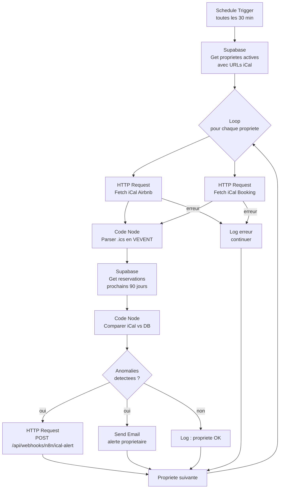

# WF02 -- iCal Sync

> Workflow de synchronisation iCal et detection d'anomalies
> Dashboard Loc Immo | Version : 1.0 | Date : 2026-02-12

---

## 1. Vue d'ensemble

### 1.1 Objectif

Filet de securite complementaire au parsing d'emails (WF01). Ce workflow interroge les flux iCal (Airbnb et Booking.com) de chaque propriete toutes les 30 minutes, compare les creneaux bloques avec les reservations existantes en base, et genere des alertes en cas de divergence.

### 1.2 Types d'anomalies detectees

| Type | Description | Gravite |
|------|-------------|---------|
| `missing_reservation` | Creneau bloque en iCal mais aucune reservation en base | Haute -- reservation potentiellement manquee |
| `missing_ical_block` | Reservation en base mais pas de creneau correspondant en iCal | Moyenne -- annulation potentielle |
| `date_mismatch` | Reservation en base avec dates differentes de l'iCal | Basse -- modification potentielle |

### 1.3 Trigger

| Parametre | Valeur |
|-----------|--------|
| **Type** | Schedule Trigger |
| **Mode** | Cron |
| **Expression** | `*/30 * * * *` (toutes les 30 minutes) |
| **Timezone** | `Europe/Paris` |

### 1.4 Diagramme du workflow



---

## 2. Configuration des nodes

### 2.1 Node 1 : Schedule Trigger

| Parametre | Valeur |
|-----------|--------|
| **Nom** | `Cron 30 min` |
| **Rule** | Every 30 minutes |
| **Timezone** | `Europe/Paris` |

### 2.2 Node 2 : Supabase -- Get proprietes

| Parametre | Valeur |
|-----------|--------|
| **Nom** | `Get proprietes avec iCal` |
| **Credential** | `Supabase - Loc Immo` |
| **Operation** | Get Many |
| **Table** | `properties` |
| **Filters** | `is_active` = `true` |
| **Return All** | Oui |
| **Select** | `id, name, owner_id, ical_airbnb_url, ical_booking_url` |

> **Note** : On filtre uniquement les proprietes actives. Les proprietes sans URL iCal seront ignorees dans la boucle.

### 2.3 Node 3 : Split In Batches (boucle)

| Parametre | Valeur |
|-----------|--------|
| **Nom** | `Boucle proprietes` |
| **Batch Size** | 1 (une propriete a la fois pour eviter la surcharge) |

### 2.4 Node 4a : HTTP Request -- Fetch iCal Airbnb

| Parametre | Valeur |
|-----------|--------|
| **Nom** | `Fetch iCal Airbnb` |
| **Method** | GET |
| **URL** | `{{ $json.ical_airbnb_url }}` |
| **Response Format** | Text |
| **Timeout** | 15000 ms |
| **Continue on Fail** | Oui |
| **Execute only if** | `{{ $json.ical_airbnb_url }}` n'est pas vide |

### 2.5 Node 4b : HTTP Request -- Fetch iCal Booking

| Parametre | Valeur |
|-----------|--------|
| **Nom** | `Fetch iCal Booking` |
| **Method** | GET |
| **URL** | `{{ $json.ical_booking_url }}` |
| **Response Format** | Text |
| **Timeout** | 15000 ms |
| **Continue on Fail** | Oui |
| **Execute only if** | `{{ $json.ical_booking_url }}` n'est pas vide |

### 2.6 Node 5 : Code Node -- Parser iCal

| Parametre | Valeur |
|-----------|--------|
| **Nom** | `Parser .ics` |
| **Language** | JavaScript |

**Code complet** :

```javascript
// ============================================================
// WF02 — Parser iCal (.ics) en liste d'evenements
// Format iCal : RFC 5545
// ============================================================

const icalAirbnb = $input.first().json.ical_airbnb_text || '';
const icalBooking = $input.first().json.ical_booking_text || '';
const propertyId = $input.first().json.property_id;
const propertyName = $input.first().json.property_name;

function parseICS(icsText, platform) {
  const events = [];
  if (!icsText) return events;

  // Decouvrir les blocs VEVENT
  const veventBlocks = icsText.match(/BEGIN:VEVENT[\s\S]*?END:VEVENT/g) || [];

  for (const block of veventBlocks) {
    const event = { platform };

    // DTSTART
    const dtStartMatch = block.match(/DTSTART[;:]([^\r\n]+)/);
    if (dtStartMatch) {
      const raw = dtStartMatch[1];
      // Format VALUE=DATE:20260315 ou 20260315
      const dateMatch = raw.match(/(\d{4})(\d{2})(\d{2})/);
      if (dateMatch) {
        event.startDate = `${dateMatch[1]}-${dateMatch[2]}-${dateMatch[3]}`;
      }
    }

    // DTEND
    const dtEndMatch = block.match(/DTEND[;:]([^\r\n]+)/);
    if (dtEndMatch) {
      const raw = dtEndMatch[1];
      const dateMatch = raw.match(/(\d{4})(\d{2})(\d{2})/);
      if (dateMatch) {
        event.endDate = `${dateMatch[1]}-${dateMatch[2]}-${dateMatch[3]}`;
      }
    }

    // SUMMARY (nom du voyageur ou "Blocked" / "Not available")
    const summaryMatch = block.match(/SUMMARY[;:]([^\r\n]+)/);
    if (summaryMatch) {
      event.summary = summaryMatch[1].trim();
    }

    // UID (identifiant unique de l'evenement)
    const uidMatch = block.match(/UID[;:]([^\r\n]+)/);
    if (uidMatch) {
      event.uid = uidMatch[1].trim();
    }

    // DESCRIPTION (parfois contient le numero de reservation)
    const descMatch = block.match(/DESCRIPTION[;:]([^\r\n]+)/);
    if (descMatch) {
      event.description = descMatch[1].trim();
    }

    // Filtrer : ne garder que les evenements futurs (prochains 90 jours)
    if (event.startDate && event.endDate) {
      const today = new Date();
      today.setHours(0, 0, 0, 0);
      const futureLimit = new Date(today);
      futureLimit.setDate(futureLimit.getDate() + 90);

      const startDate = new Date(event.startDate);

      if (startDate >= today && startDate <= futureLimit) {
        events.push(event);
      }
    }
  }

  return events;
}

// Parser les deux flux iCal
const airbnbEvents = parseICS(icalAirbnb, 'airbnb');
const bookingEvents = parseICS(icalBooking, 'booking');

// Combiner les evenements
const allEvents = [...airbnbEvents, ...bookingEvents];

// Filtrer les evenements "bloques" (pas de vrai nom de voyageur)
// Airbnb : SUMMARY = "Reserved" ou "Not available" ou nom du voyageur
// Booking : SUMMARY = "CLOSED - Not available" ou nom
const blockedKeywords = [
  'not available', 'blocked', 'closed', 'reserve', 'unavailable',
  'indisponible', 'bloqu',
];

const realBookings = [];
const blockedPeriods = [];

for (const event of allEvents) {
  const summaryLower = (event.summary || '').toLowerCase();
  const isBlocked = blockedKeywords.some(kw => summaryLower.includes(kw));

  if (isBlocked) {
    blockedPeriods.push(event);
  } else {
    realBookings.push(event);
  }
}

return [{
  propertyId,
  propertyName,
  icalEvents: allEvents,
  realBookings,
  blockedPeriods,
  totalEvents: allEvents.length,
}];
```

### 2.7 Node 6 : Supabase -- Get reservations existantes

| Parametre | Valeur |
|-----------|--------|
| **Nom** | `Get reservations DB` |
| **Credential** | `Supabase - Loc Immo` |
| **Operation** | Get Many |
| **Table** | `reservations` |
| **Return All** | Oui |
| **Filters** | |
| | `property_id` = `{{ $json.propertyId }}` |
| | `check_in` >= `{{ $today.toISOString().slice(0, 10) }}` |
| | `check_in` <= date dans 90 jours |
| | `status` != `cancelled` |
| **Select** | `id, platform, platform_ref_id, check_in, check_out, status` |

### 2.8 Node 7 : Code Node -- Comparer iCal vs DB

```javascript
// ============================================================
// WF02 — Comparer les evenements iCal avec les reservations en DB
// Generer les alertes d'anomalie
// ============================================================

const icalData = $input.first().json;
const reservations = $node['Get reservations DB'].json || [];
const propertyId = icalData.propertyId;
const propertyName = icalData.propertyName;

const alerts = [];

// --- 1. Detecter les creneaux iCal sans reservation en DB ---
// (realBookings = evenements avec un nom de voyageur, pas des blocages)
for (const event of icalData.realBookings) {
  // Chercher une reservation correspondante en DB
  const match = reservations.find(r => {
    // Match par dates (avec tolerance de +/- 1 jour pour les fuseaux)
    const sameStart = r.check_in === event.startDate;
    const sameEnd = r.check_out === event.endDate;

    // Ou match par platform + dates approximatives
    const samePlatform = r.platform === event.platform;
    const closeStart = Math.abs(
      new Date(r.check_in) - new Date(event.startDate)
    ) <= 86400000; // 1 jour en ms
    const closeEnd = Math.abs(
      new Date(r.check_out) - new Date(event.endDate)
    ) <= 86400000;

    return (sameStart && sameEnd) || (samePlatform && closeStart && closeEnd);
  });

  if (!match) {
    alerts.push({
      alertType: 'missing_reservation',
      propertyName,
      propertyId,
      icalBlockedFrom: event.startDate,
      icalBlockedTo: event.endDate,
      platform: event.platform,
      message: `Creneau ${event.platform} (${event.startDate} -> ${event.endDate}) ` +
        `avec voyageur "${event.summary}" sans reservation correspondante en base. ` +
        `L'email de confirmation a peut-etre ete manque.`,
    });
  }
}

// --- 2. Detecter les reservations DB sans creneau iCal ---
for (const resa of reservations) {
  // Ne verifier que les reservations de plateformes (pas manuelles)
  if (resa.platform === 'manual') continue;

  const match = icalData.icalEvents.find(event => {
    const sameStart = event.startDate === resa.check_in;
    const sameEnd = event.endDate === resa.check_out;
    const samePlatform = event.platform === resa.platform;
    const closeStart = Math.abs(
      new Date(event.startDate) - new Date(resa.check_in)
    ) <= 86400000;
    const closeEnd = Math.abs(
      new Date(event.endDate) - new Date(resa.check_out)
    ) <= 86400000;

    return (sameStart && sameEnd) || (samePlatform && closeStart && closeEnd);
  });

  if (!match) {
    alerts.push({
      alertType: 'missing_ical_block',
      propertyName,
      propertyId,
      icalBlockedFrom: resa.check_in,
      icalBlockedTo: resa.check_out,
      platform: resa.platform,
      message: `Reservation ${resa.platform} (${resa.check_in} -> ${resa.check_out}) ` +
        `en base mais aucun creneau correspondant en iCal. ` +
        `Possible annulation non detectee.`,
    });
  }
}

// --- 3. Detecter les date mismatches ---
for (const resa of reservations) {
  if (resa.platform === 'manual') continue;

  const match = icalData.icalEvents.find(event => {
    return event.platform === resa.platform &&
      (event.startDate === resa.check_in || event.endDate === resa.check_out);
  });

  if (match) {
    const startMismatch = match.startDate !== resa.check_in;
    const endMismatch = match.endDate !== resa.check_out;

    if (startMismatch || endMismatch) {
      const details = [];
      if (startMismatch) {
        details.push(`Check-in : DB=${resa.check_in}, iCal=${match.startDate}`);
      }
      if (endMismatch) {
        details.push(`Check-out : DB=${resa.check_out}, iCal=${match.endDate}`);
      }

      alerts.push({
        alertType: 'date_mismatch',
        propertyName,
        propertyId,
        icalBlockedFrom: match.startDate,
        icalBlockedTo: match.endDate,
        platform: resa.platform,
        message: `Ecart de dates detecte pour ${resa.platform}. ${details.join('. ')}. ` +
          `Possible modification non detectee.`,
      });
    }
  }
}

return [{
  propertyId,
  propertyName,
  alertCount: alerts.length,
  alerts,
  _summary: alerts.length === 0
    ? `${propertyName} : OK, aucune anomalie`
    : `${propertyName} : ${alerts.length} anomalie(s) detectee(s)`,
}];
```

### 2.9 Node 8 : IF (anomalies detectees ?)

| Parametre | Valeur |
|-----------|--------|
| **Nom** | `Anomalies ?` |
| **Condition** | `{{ $json.alertCount }}` > 0 |

### 2.10 Node 9a : HTTP Request -- POST alertes

Pour chaque alerte, envoyer un POST au webhook :

| Parametre | Valeur |
|-----------|--------|
| **Nom** | `Envoyer alertes` |
| **Method** | POST |
| **URL** | `{{ $env.DASHBOARD_URL }}/api/webhooks/n8n/ical-alert` |
| **Authentication** | Header Auth (`API Key - Dashboard`) |
| **Body Type** | JSON |
| **Body** | Chaque alerte individuelle |
| **Retry on Fail** | Oui, 2 retries |

> **Note** : Utiliser un node Split In Batches pour envoyer chaque alerte individuellement, ou boucler dans un Code Node.

### 2.11 Node 9b : Send Email -- Alerte proprietaire

| Parametre | Valeur |
|-----------|--------|
| **Nom** | `Email alerte proprietaire` |
| **Credential** | `SMTP - Loc Immo` |
| **To** | `{{ $env.OWNER_EMAIL }}` |
| **Subject** | `[Loc Immo] {{ $json.alertCount }} alerte(s) iCal — {{ $json.propertyName }}` |

**Body (HTML)** :

```html
<h2>Alertes iCal detectees</h2>
<p><strong>Propriete :</strong> {{ $json.propertyName }}</p>
<p><strong>Nombre d'alertes :</strong> {{ $json.alertCount }}</p>

<table border="1" cellpadding="8" cellspacing="0" style="border-collapse: collapse;">
  <thead>
    <tr>
      <th>Type</th>
      <th>Plateforme</th>
      <th>Dates iCal</th>
      <th>Detail</th>
    </tr>
  </thead>
  <tbody>
    <!-- Boucle sur les alertes -->
    {{#each alerts}}
    <tr>
      <td>{{ alertType }}</td>
      <td>{{ platform }}</td>
      <td>{{ icalBlockedFrom }} -> {{ icalBlockedTo }}</td>
      <td>{{ message }}</td>
    </tr>
    {{/each}}
  </tbody>
</table>

<p>
  <a href="{{ $env.DASHBOARD_URL }}/dashboard/reservations">
    Voir le dashboard
  </a>
</p>
```

> **Implementation n8n** : Comme n8n ne supporte pas Handlebars nativement dans le Send Email, construire le HTML dans un Code Node precedent.

---

## 3. Gestion des erreurs

### 3.1 Echec du fetch iCal

- **Continue on Fail** active sur les nodes HTTP de fetch iCal
- Si le fetch echoue pour une propriete, on log l'erreur et on passe a la propriete suivante
- L'erreur est loguee mais ne bloque pas le traitement des autres proprietes

### 3.2 URL iCal invalide ou expiree

Les URLs iCal Airbnb/Booking peuvent expirer ou changer. En cas d'erreur 403/404/timeout :

1. L'erreur est loguee dans l'execution n8n
2. Si une meme URL echoue 3 fois consecutivement (a suivre manuellement), notifier le proprietaire pour regenerer l'URL

### 3.3 Timeout

- Timeout des requetes HTTP : 15 secondes
- Si le flux iCal est volumineux, le parser gere les fichiers jusqu'a 1 Mo sans probleme
- Au-dela, envisager un streaming (Phase 2)

### 3.4 Error Trigger (global)

```javascript
return [{
  to: $env.OWNER_EMAIL,
  subject: '[Loc Immo] ERREUR - WF02 iCal Sync',
  body: `Le workflow de synchronisation iCal a rencontre une erreur.\n\n` +
    `Erreur : ${$json.error?.message || 'Inconnue'}\n` +
    `Node : ${$json.error?.node || 'Inconnu'}\n` +
    `Heure : ${new Date().toISOString()}\n\n` +
    `Les proprietes suivantes n'ont peut-etre pas ete verifiees.`,
}];
```

---

## 4. Format iCal -- Reference

### 4.1 Structure d'un fichier .ics

```
BEGIN:VCALENDAR
VERSION:2.0
PRODID:-//Airbnb Inc//Hosting Calendar//EN
CALSCALE:GREGORIAN
BEGIN:VEVENT
DTSTART;VALUE=DATE:20260315
DTEND;VALUE=DATE:20260318
SUMMARY:Jean Dupont (HMAB12CD34)
UID:abcdef-1234-5678@airbnb.com
DESCRIPTION:Reservation confirmed
END:VEVENT
BEGIN:VEVENT
DTSTART;VALUE=DATE:20260320
DTEND;VALUE=DATE:20260320
SUMMARY:Not available
UID:xyz-blocked@airbnb.com
END:VEVENT
END:VCALENDAR
```

### 4.2 Champs extraits

| Champ iCal | Usage |
|------------|-------|
| `DTSTART` | Date d'arrivee (check-in) |
| `DTEND` | Date de depart (check-out) |
| `SUMMARY` | Nom du voyageur ou indication de blocage |
| `UID` | Identifiant unique de l'evenement |
| `DESCRIPTION` | Informations complementaires (parfois la reference) |

### 4.3 Specificites par plateforme

**Airbnb** :
- SUMMARY contient le nom du voyageur et parfois la reference entre parentheses
- Les periodes bloquees manuellement ont SUMMARY = "Not available" ou "Blocked"
- Les dates sont au format `VALUE=DATE:YYYYMMDD`

**Booking.com** :
- SUMMARY contient "CLOSED - Not available" pour les blocages
- Les reservations ont le nom du voyageur en SUMMARY
- Le numero de confirmation peut apparaitre dans DESCRIPTION
- Les dates sont au format `VALUE=DATE:YYYYMMDD`

---

## 5. Optimisations

### 5.1 Eviter les alertes en double

Le workflow ne doit pas generer la meme alerte a chaque execution. Strategies :

1. **Cache en memoire** : Stocker les alertes envoyees dans les 24 dernieres heures (via une variable statique n8n ou un node de stockage)
2. **Deduplication cote webhook** : Le endpoint `/api/webhooks/n8n/ical-alert` peut verifier si une alerte identique a deja ete recue recemment
3. **Phase 2** : Table `alerts` en base avec unicite sur `(property_id, alert_type, ical_blocked_from, ical_blocked_to)`

### 5.2 Parallelisation

En Phase 2, si le nombre de proprietes augmente (>10), envisager :
- Augmenter le batch size de la boucle
- Fetch des iCal en parallele (2-3 proprietes a la fois)
- Utiliser des sub-workflows pour chaque propriete

---

*Document genere le 2026-02-12 -- Pipeline B04-Automations / WF02*
