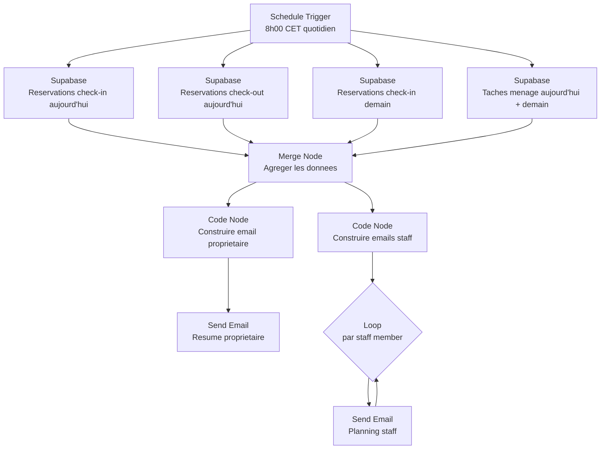

# WF03 -- Notifications quotidiennes

> Workflow de resume quotidien pour le proprietaire et rappels pour le personnel de menage
> Dashboard Loc Immo | Version : 1.0 | Date : 2026-02-12

---

## 1. Vue d'ensemble

### 1.1 Objectif

Envoyer chaque matin un email recapitulatif au proprietaire (Ilyes) avec les arrivees et departs du jour et du lendemain, ainsi qu'un email individuel a chaque membre du personnel de menage avec ses taches planifiees.

### 1.2 Trigger

| Parametre | Valeur |
|-----------|--------|
| **Type** | Schedule Trigger |
| **Mode** | Cron |
| **Expression** | `0 8 * * *` (tous les jours a 8h00) |
| **Timezone** | `Europe/Paris` |

### 1.3 Diagramme du workflow



---

## 2. Configuration des nodes

### 2.1 Node 1 : Schedule Trigger

| Parametre | Valeur |
|-----------|--------|
| **Nom** | `Cron quotidien 8h` |
| **Expression Cron** | `0 8 * * *` |
| **Timezone** | `Europe/Paris` |

### 2.2 Nodes 2a-2c : Supabase -- Requetes reservations

**Node 2a : Check-ins aujourd'hui**

| Parametre | Valeur |
|-----------|--------|
| **Nom** | `Check-ins aujourd'hui` |
| **Table** | `reservations` |
| **Operation** | Get Many |
| **Return All** | Oui |
| **Filters** | `check_in` = aujourd'hui, `status` != `cancelled` |
| **Select** | `*, property:properties(name, address, access_code), guest:guests(full_name, email, phone)` |

> **Expression pour aujourd'hui** : `{{ $today.toISOString().slice(0, 10) }}`

**Node 2b : Check-outs aujourd'hui**

| Parametre | Valeur |
|-----------|--------|
| **Nom** | `Check-outs aujourd'hui` |
| **Table** | `reservations` |
| **Filters** | `check_out` = aujourd'hui, `status` != `cancelled` |
| **Select** | idem 2a |

**Node 2c : Check-ins demain**

| Parametre | Valeur |
|-----------|--------|
| **Nom** | `Check-ins demain` |
| **Table** | `reservations` |
| **Filters** | `check_in` = demain, `status` != `cancelled` |
| **Select** | idem 2a |

> **Expression pour demain** : Calculee dans un Code Node ou via `{{ DateTime.now().plus({ days: 1 }).toISODate() }}`

### 2.3 Node 2d : Supabase -- Taches menage

| Parametre | Valeur |
|-----------|--------|
| **Nom** | `Taches menage aujourd'hui + demain` |
| **Table** | `cleaning_tasks` |
| **Filters** | `scheduled_date` >= aujourd'hui ET `scheduled_date` <= demain, `status` != `completed` |
| **Select** | `*, property:properties(name, address, city, access_code, wifi_ssid, wifi_password), assigned_user:users!assigned_to(id, full_name, email), reservation:reservations(check_in, check_out, nb_guests, arrival_time, special_requests, guest:guests(full_name))` |
| **Return All** | Oui |

### 2.4 Node 3 : Code Node -- Construire email proprietaire

```javascript
// ============================================================
// WF03 — Construire le HTML du resume quotidien proprietaire
// ============================================================

const checkInsToday = $node['Check-ins aujourd\'hui'].json || [];
const checkOutsToday = $node['Check-outs aujourd\'hui'].json || [];
const checkInsTomorrow = $node['Check-ins demain'].json || [];
const tasks = $node['Taches menage aujourd\'hui + demain'].json || [];

const today = new Date();
const tomorrow = new Date(today);
tomorrow.setDate(tomorrow.getDate() + 1);

const formatDate = (d) => d.toLocaleDateString('fr-FR', {
  weekday: 'long', day: 'numeric', month: 'long', year: 'numeric'
});

// --- Construction du HTML ---
let html = `
<div style="font-family: -apple-system, sans-serif; max-width: 600px; margin: 0 auto;">
  <h1 style="color: #1a1a2e; border-bottom: 2px solid #3b82f6; padding-bottom: 8px;">
    Resume quotidien
  </h1>
  <p style="color: #6b7280;">${formatDate(today)}</p>
`;

// --- Arrivees aujourd'hui ---
html += `<h2 style="color: #059669;">Arrivees aujourd'hui (${checkInsToday.length})</h2>`;
if (checkInsToday.length === 0) {
  html += `<p style="color: #9ca3af;">Aucune arrivee aujourd'hui.</p>`;
} else {
  html += `<table border="0" cellpadding="8" style="width: 100%; border-collapse: collapse;">`;
  for (const r of checkInsToday) {
    const guest = r.guest?.full_name || 'Voyageur inconnu';
    const property = r.property?.name || 'Propriete inconnue';
    const arrival = r.arrival_time || 'non renseignee';
    const requests = r.special_requests || '-';
    html += `
      <tr style="border-bottom: 1px solid #e5e7eb;">
        <td><strong>${property}</strong></td>
        <td>${guest}</td>
        <td>Arrivee : ${arrival}</td>
        <td>${r.nb_guests} voyageur(s)</td>
      </tr>`;
    if (requests !== '-') {
      html += `
      <tr style="border-bottom: 1px solid #e5e7eb; background: #fef3c7;">
        <td colspan="4">Demande speciale : ${requests}</td>
      </tr>`;
    }
  }
  html += `</table>`;
}

// --- Departs aujourd'hui ---
html += `<h2 style="color: #dc2626;">Departs aujourd'hui (${checkOutsToday.length})</h2>`;
if (checkOutsToday.length === 0) {
  html += `<p style="color: #9ca3af;">Aucun depart aujourd'hui.</p>`;
} else {
  html += `<table border="0" cellpadding="8" style="width: 100%; border-collapse: collapse;">`;
  for (const r of checkOutsToday) {
    const guest = r.guest?.full_name || 'Voyageur inconnu';
    const property = r.property?.name || 'Propriete inconnue';
    html += `
      <tr style="border-bottom: 1px solid #e5e7eb;">
        <td><strong>${property}</strong></td>
        <td>${guest}</td>
        <td>Menage a prevoir</td>
      </tr>`;
  }
  html += `</table>`;
}

// --- Arrivees demain ---
html += `<h2 style="color: #2563eb;">Arrivees demain (${checkInsTomorrow.length})</h2>`;
if (checkInsTomorrow.length === 0) {
  html += `<p style="color: #9ca3af;">Aucune arrivee demain.</p>`;
} else {
  html += `<table border="0" cellpadding="8" style="width: 100%; border-collapse: collapse;">`;
  for (const r of checkInsTomorrow) {
    const guest = r.guest?.full_name || 'Voyageur inconnu';
    const property = r.property?.name || 'Propriete inconnue';
    html += `
      <tr style="border-bottom: 1px solid #e5e7eb;">
        <td><strong>${property}</strong></td>
        <td>${guest}</td>
        <td>${r.nb_guests} voyageur(s)</td>
        <td>${r.platform}</td>
      </tr>`;
  }
  html += `</table>`;
}

// --- Resume taches menage ---
const pendingTasks = tasks.filter(t => t.status !== 'completed');
html += `<h2 style="color: #7c3aed;">Taches menage en attente (${pendingTasks.length})</h2>`;
if (pendingTasks.length === 0) {
  html += `<p style="color: #9ca3af;">Aucune tache en attente.</p>`;
} else {
  html += `<table border="0" cellpadding="8" style="width: 100%; border-collapse: collapse;">`;
  for (const t of pendingTasks) {
    const property = t.property?.name || '-';
    const staff = t.assigned_user?.full_name || 'Non assigne';
    const type = t.type === 'checkout_clean' ? 'Menage depart' :
                 t.type === 'checkin_prep' ? 'Preparation arrivee' : 'Menage complet';
    const statusBadge = t.status === 'pending'
      ? '<span style="color: #f59e0b;">En attente</span>'
      : '<span style="color: #3b82f6;">En cours</span>';
    html += `
      <tr style="border-bottom: 1px solid #e5e7eb;">
        <td><strong>${property}</strong></td>
        <td>${type}</td>
        <td>${staff}</td>
        <td>${statusBadge}</td>
        <td>${t.scheduled_date}</td>
      </tr>`;
  }
  html += `</table>`;
}

// --- Lien dashboard ---
html += `
  <div style="margin-top: 24px; text-align: center;">
    <a href="${$env.DASHBOARD_URL}/dashboard"
       style="display: inline-block; padding: 12px 24px; background: #3b82f6;
              color: white; text-decoration: none; border-radius: 8px;">
      Ouvrir le dashboard
    </a>
  </div>
</div>`;

// --- Sujet dynamique ---
const totalEvents = checkInsToday.length + checkOutsToday.length;
const subject = totalEvents > 0
  ? `[Loc Immo] ${checkInsToday.length} arrivee(s), ${checkOutsToday.length} depart(s) aujourd'hui`
  : `[Loc Immo] Resume du ${formatDate(today)} — aucun mouvement`;

return [{
  ownerEmail: $env.OWNER_EMAIL,
  subject,
  html,
}];
```

### 2.5 Node 4 : Send Email -- Resume proprietaire

| Parametre | Valeur |
|-----------|--------|
| **Nom** | `Email resume proprietaire` |
| **Credential** | `SMTP - Loc Immo` |
| **To** | `{{ $json.ownerEmail }}` |
| **Subject** | `{{ $json.subject }}` |
| **HTML** | `{{ $json.html }}` |
| **From Name** | `Loc Immo` |

### 2.6 Node 5 : Code Node -- Construire emails staff

```javascript
// ============================================================
// WF03 — Preparer un email par membre du staff
// Regrouper les taches par staff assigne
// ============================================================

const tasks = $node['Taches menage aujourd\'hui + demain'].json || [];

// Regrouper par staff
const staffMap = new Map();

for (const task of tasks) {
  if (task.status === 'completed') continue;
  if (!task.assigned_to) continue; // Tache non assignee

  const staffId = task.assigned_to;
  if (!staffMap.has(staffId)) {
    staffMap.set(staffId, {
      staffId,
      staffName: task.assigned_user?.full_name || 'Inconnu',
      staffEmail: task.assigned_user?.email || null,
      tasks: [],
    });
  }

  staffMap.get(staffId).tasks.push({
    propertyName: task.property?.name || '-',
    propertyAddress: task.property?.address || '-',
    propertyCity: task.property?.city || '-',
    accessCode: task.property?.access_code || '-',
    wifiSsid: task.property?.wifi_ssid || '-',
    wifiPassword: task.property?.wifi_password || '-',
    type: task.type,
    scheduledDate: task.scheduled_date,
    nbGuests: task.reservation?.nb_guests || '-',
    arrivalTime: task.reservation?.arrival_time || 'non renseignee',
    guestName: task.reservation?.guest?.full_name || '-',
    specialRequests: task.reservation?.special_requests || null,
    notes: task.notes || null,
  });
}

// Construire un email par staff
const emails = [];
const today = new Date().toLocaleDateString('fr-FR', {
  weekday: 'long', day: 'numeric', month: 'long'
});

for (const [, staff] of staffMap) {
  if (!staff.staffEmail) continue;

  let html = `
  <div style="font-family: -apple-system, sans-serif; max-width: 600px; margin: 0 auto;">
    <h1 style="color: #1a1a2e;">Bonjour ${staff.staffName.split(' ')[0]},</h1>
    <p>Voici ton planning pour aujourd'hui et demain.</p>
  `;

  for (const task of staff.tasks) {
    const typeLabel = task.type === 'checkout_clean' ? 'Menage depart' :
                      task.type === 'checkin_prep' ? 'Preparation arrivee' : 'Menage complet';
    const isToday = task.scheduledDate === new Date().toISOString().slice(0, 10);
    const dateLabel = isToday ? "Aujourd'hui" : 'Demain';
    const urgentStyle = isToday ? 'border-left: 4px solid #dc2626;' : 'border-left: 4px solid #3b82f6;';

    html += `
    <div style="margin: 16px 0; padding: 16px; background: #f9fafb; border-radius: 8px; ${urgentStyle}">
      <h3 style="margin: 0 0 8px 0;">${typeLabel} — ${dateLabel} (${task.scheduledDate})</h3>
      <p style="margin: 4px 0;"><strong>Logement :</strong> ${task.propertyName}</p>
      <p style="margin: 4px 0;"><strong>Adresse :</strong>
        <a href="https://maps.google.com/?q=${encodeURIComponent(task.propertyAddress + ', ' + task.propertyCity)}">
          ${task.propertyAddress}, ${task.propertyCity}
        </a>
      </p>
      <p style="margin: 4px 0;"><strong>Code d'acces :</strong> ${task.accessCode}</p>
      <p style="margin: 4px 0;"><strong>Wifi :</strong> ${task.wifiSsid} / ${task.wifiPassword}</p>
      <p style="margin: 4px 0;"><strong>Voyageur :</strong> ${task.guestName} (${task.nbGuests} pers.)</p>
      <p style="margin: 4px 0;"><strong>Heure d'arrivee :</strong> ${task.arrivalTime}</p>`;

    if (task.specialRequests) {
      html += `
      <div style="margin-top: 8px; padding: 8px; background: #fef3c7; border-radius: 4px;">
        <strong>Demande speciale :</strong> ${task.specialRequests}
      </div>`;
    }

    if (task.notes) {
      html += `<p style="margin: 8px 0 0 0; color: #6b7280;"><em>Notes : ${task.notes}</em></p>`;
    }

    html += `</div>`;
  }

  html += `
    <div style="margin-top: 24px; text-align: center;">
      <a href="${$env.DASHBOARD_URL}/cleaning"
         style="display: inline-block; padding: 12px 24px; background: #059669;
                color: white; text-decoration: none; border-radius: 8px;">
        Voir mon planning complet
      </a>
    </div>
  </div>`;

  emails.push({
    to: staff.staffEmail,
    subject: `[Loc Immo] Ton planning — ${today} (${staff.tasks.length} tache(s))`,
    html,
    staffName: staff.staffName,
  });
}

return emails;
```

### 2.7 Node 6 : Loop + Send Email -- Planning staff

**Split In Batches** pour envoyer un email par staff :

| Parametre | Valeur |
|-----------|--------|
| **Batch Size** | 1 |

Suivi du node **Send Email** :

| Parametre | Valeur |
|-----------|--------|
| **Credential** | `SMTP - Loc Immo` |
| **To** | `{{ $json.to }}` |
| **Subject** | `{{ $json.subject }}` |
| **HTML** | `{{ $json.html }}` |

---

## 3. Gestion des erreurs

### 3.1 Aucune donnee

Si aucune reservation et aucune tache n'est trouvee pour la journee, le workflow envoie quand meme le resume au proprietaire avec le message "Aucun mouvement" (pas de notification staff dans ce cas).

### 3.2 Echec envoi email

- Les emails au staff sont envoyes dans une boucle avec **Continue on Fail** active
- Si un email echoue, les autres sont quand meme envoyes
- L'email proprietaire est envoye en premier (prioritaire)

### 3.3 Error Trigger

```javascript
return [{
  to: $env.OWNER_EMAIL,
  subject: '[Loc Immo] ERREUR - WF03 Notifications quotidiennes',
  body: `Le workflow de notifications quotidiennes a echoue.\n\n` +
    `Erreur : ${$json.error?.message || 'Inconnue'}\n` +
    `Heure : ${new Date().toISOString()}\n\n` +
    `Le resume quotidien n'a peut-etre pas ete envoye.`,
}];
```

---

## 4. Personnalisation

### 4.1 Horaire d'envoi

L'horaire de 8h00 est configurable via l'expression cron. Si le proprietaire ou le staff souhaite recevoir le resume plus tot ou plus tard, modifier l'expression :

- `0 7 * * *` : 7h00
- `0 9 * * *` : 9h00
- `0 8 * * 1-5` : uniquement en semaine a 8h00

### 4.2 Contenu conditionnel

- Les demandes speciales des voyageurs sont mises en evidence (fond jaune)
- Les taches du jour sont marquees avec une bordure rouge (urgentes)
- Les taches de demain sont marquees avec une bordure bleue

### 4.3 Evolution Phase 2

| Fonctionnalite | Description |
|----------------|-------------|
| Notifications push | Envoyer une notification push en plus de l'email |
| SMS de rappel | SMS au staff 1h avant l'intervention |
| Rapport hebdomadaire | Resume de la semaine chaque dimanche soir |
| Alertes non-assignation | Notifier si une tache n'est assignee a personne |

---

*Document genere le 2026-02-12 -- Pipeline B04-Automations / WF03*
