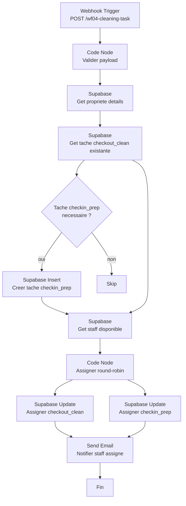

# WF04 -- Creation automatique des taches de menage

> Workflow de creation et assignation automatique des taches de menage
> Dashboard Loc Immo | Version : 1.0 | Date : 2026-02-12

---

## 1. Vue d'ensemble

### 1.1 Objectif

Automatiser la creation de taches de menage supplementaires et leur assignation au personnel lorsqu'une nouvelle reservation est detectee. Ce workflow est appele par WF01 (Email Parser) apres la creation d'une reservation.

> **Note importante** : L'API webhook `/api/webhooks/n8n/reservation` cree deja automatiquement une tache `checkout_clean` lors de l'insertion d'une nouvelle reservation. Le WF04 se charge donc de :
> 1. Creer une tache `checkin_prep` (preparation avant l'arrivee)
> 2. Assigner les taches au personnel disponible
> 3. Notifier le staff assigne

### 1.2 Trigger

| Parametre | Valeur |
|-----------|--------|
| **Type** | Webhook |
| **Method** | POST |
| **Path** | `/wf04-cleaning-task` |
| **Response** | Immediately (200 OK) |
| **Authentication** | None (interne n8n -> n8n) |

### 1.3 Diagramme du workflow



---

## 2. Payload d'entree

Le webhook recoit les donnees de la reservation nouvellement creee :

```json
{
  "id": "uuid-reservation",
  "property_id": "uuid-propriete",
  "guest_id": "uuid-voyageur",
  "platform": "airbnb",
  "check_in": "2026-03-15",
  "check_out": "2026-03-18",
  "nb_guests": 2,
  "status": "confirmed",
  "guest_name": "Jean Dupont"
}
```

---

## 3. Configuration des nodes

### 3.1 Node 1 : Webhook Trigger

| Parametre | Valeur |
|-----------|--------|
| **Nom** | `Recevoir nouvelle reservation` |
| **HTTP Method** | POST |
| **Path** | `wf04-cleaning-task` |
| **Response Mode** | Immediately |
| **Response Code** | 200 |

### 3.2 Node 2 : Code Node -- Validation

```javascript
// Valider le payload minimal
const data = $input.first().json;

const required = ['id', 'property_id', 'check_in', 'check_out'];
const missing = required.filter(field => !data[field]);

if (missing.length > 0) {
  throw new Error(`Champs manquants dans le payload : ${missing.join(', ')}`);
}

// Verifier que check_out > check_in
if (data.check_out <= data.check_in) {
  throw new Error(`Dates invalides : check_in=${data.check_in}, check_out=${data.check_out}`);
}

return [data];
```

### 3.3 Node 3 : Supabase -- Get propriete

| Parametre | Valeur |
|-----------|--------|
| **Nom** | `Get propriete` |
| **Table** | `properties` |
| **Operation** | Get |
| **Filter** | `id` = `{{ $json.property_id }}` |
| **Select** | `id, name, owner_id, address, city, access_code` |

### 3.4 Node 4 : Supabase -- Get tache checkout_clean existante

| Parametre | Valeur |
|-----------|--------|
| **Nom** | `Get tache checkout existante` |
| **Table** | `cleaning_tasks` |
| **Operation** | Get Many |
| **Filters** | `reservation_id` = `{{ $json.id }}`, `type` = `checkout_clean` |
| **Return All** | Oui |

> Cette requete verifie que la tache `checkout_clean` a bien ete creee par l'API webhook. Si elle n'existe pas (cas improbable), on la cree.

### 3.5 Node 5 : IF -- Creer tache checkin_prep ?

La tache `checkin_prep` est creee uniquement si le check-in est dans plus de 24h (sinon, inutile de preparer).

| Parametre | Valeur |
|-----------|--------|
| **Condition** | `{{ DateTime.fromISO($json.check_in).diffNow('hours').hours }}` > 24 |

### 3.6 Node 6 : Supabase Insert -- Tache checkin_prep

| Parametre | Valeur |
|-----------|--------|
| **Nom** | `Creer tache checkin_prep` |
| **Table** | `cleaning_tasks` |
| **Operation** | Insert |

**Donnees a inserer** :

```json
{
  "reservation_id": "{{ $node['Recevoir nouvelle reservation'].json.id }}",
  "property_id": "{{ $node['Recevoir nouvelle reservation'].json.property_id }}",
  "type": "checkin_prep",
  "status": "pending",
  "scheduled_date": "{{ $node['Recevoir nouvelle reservation'].json.check_in }}",
  "checklist": [
    { "label": "Verifier la proprete generale", "done": false },
    { "label": "Installer les draps propres", "done": false },
    { "label": "Disposer les serviettes", "done": false },
    { "label": "Verifier les produits d'accueil", "done": false },
    { "label": "Verifier le fonctionnement du chauffage/climatisation", "done": false },
    { "label": "Laisser les cles / verifier le digicode", "done": false }
  ]
}
```

### 3.7 Node 7 : Supabase -- Get staff disponible

| Parametre | Valeur |
|-----------|--------|
| **Nom** | `Get staff actif` |
| **Table** | `users` |
| **Operation** | Get Many |
| **Filters** | `role` = `cleaning_staff`, `is_active` = `true` |
| **Return All** | Oui |
| **Select** | `id, full_name, email` |

### 3.8 Node 8 : Code Node -- Assignation round-robin

```javascript
// ============================================================
// WF04 — Assignation round-robin des taches de menage
// Assigne a chaque tache le staff ayant le moins de taches
// planifiees cette semaine
// ============================================================

const staffList = $node['Get staff actif'].json || [];
const reservation = $node['Recevoir nouvelle reservation'].json;
const checkoutTask = $node['Get tache checkout existante'].json?.[0];
const checkinTask = $node['Creer tache checkin_prep']?.json; // peut etre null

if (staffList.length === 0) {
  // Aucun staff disponible — les taches restent non assignees
  return [{
    assignedCheckout: null,
    assignedCheckin: null,
    warning: 'Aucun personnel de menage actif. Taches non assignees.',
  }];
}

if (staffList.length === 1) {
  // Un seul staff -> on lui assigne tout
  return [{
    assignedCheckout: {
      taskId: checkoutTask?.id,
      staffId: staffList[0].id,
      staffName: staffList[0].full_name,
      staffEmail: staffList[0].email,
    },
    assignedCheckin: checkinTask ? {
      taskId: checkinTask.id,
      staffId: staffList[0].id,
      staffName: staffList[0].full_name,
      staffEmail: staffList[0].email,
    } : null,
  }];
}

// Round-robin : assigner au staff avec le moins de taches
// Pour un MVP simple, on alterne entre les staff par index
// En Phase 2 : requete Supabase pour compter les taches par staff

// Simple round-robin base sur le timestamp
const staffIndex = Math.floor(Date.now() / 1000) % staffList.length;
const checkoutStaff = staffList[staffIndex];
const checkinStaff = staffList[(staffIndex + 1) % staffList.length]; // staff different si possible

return [{
  assignedCheckout: {
    taskId: checkoutTask?.id,
    staffId: checkoutStaff.id,
    staffName: checkoutStaff.full_name,
    staffEmail: checkoutStaff.email,
  },
  assignedCheckin: checkinTask ? {
    taskId: checkinTask.id,
    staffId: checkinStaff.id,
    staffName: checkinStaff.full_name,
    staffEmail: checkinStaff.email,
  } : null,
}];
```

### 3.9 Nodes 9a/9b : Supabase Update -- Assigner les taches

**Assigner checkout_clean** :

| Parametre | Valeur |
|-----------|--------|
| **Table** | `cleaning_tasks` |
| **Operation** | Update |
| **Filter** | `id` = `{{ $json.assignedCheckout.taskId }}` |
| **Data** | `{ "assigned_to": "{{ $json.assignedCheckout.staffId }}" }` |
| **Execute only if** | `{{ $json.assignedCheckout }}` n'est pas null |

**Assigner checkin_prep** :

| Parametre | Valeur |
|-----------|--------|
| **Table** | `cleaning_tasks` |
| **Operation** | Update |
| **Filter** | `id` = `{{ $json.assignedCheckin.taskId }}` |
| **Data** | `{ "assigned_to": "{{ $json.assignedCheckin.staffId }}" }` |
| **Execute only if** | `{{ $json.assignedCheckin }}` n'est pas null |

### 3.10 Node 10 : Send Email -- Notification staff

```javascript
// Construire les emails de notification pour le staff assigne
const data = $input.first().json;
const reservation = $node['Recevoir nouvelle reservation'].json;
const property = $node['Get propriete'].json;

const emails = [];

// Email pour le staff du checkout
if (data.assignedCheckout?.staffEmail) {
  emails.push({
    to: data.assignedCheckout.staffEmail,
    subject: `[Loc Immo] Nouvelle tache : menage depart — ${property.name} (${reservation.check_out})`,
    html: `
      <div style="font-family: -apple-system, sans-serif; max-width: 500px;">
        <h2>Nouvelle tache de menage</h2>
        <p>Bonjour ${data.assignedCheckout.staffName.split(' ')[0]},</p>
        <p>Une nouvelle tache de menage t'a ete assignee :</p>
        <div style="padding: 16px; background: #f9fafb; border-radius: 8px; border-left: 4px solid #dc2626;">
          <p><strong>Type :</strong> Menage depart</p>
          <p><strong>Date :</strong> ${reservation.check_out}</p>
          <p><strong>Logement :</strong> ${property.name}</p>
          <p><strong>Adresse :</strong>
            <a href="https://maps.google.com/?q=${encodeURIComponent(property.address + ', ' + property.city)}">
              ${property.address}
            </a>
          </p>
        </div>
        <p style="margin-top: 16px;">
          <a href="${$env.DASHBOARD_URL}/cleaning"
             style="display: inline-block; padding: 10px 20px; background: #059669;
                    color: white; text-decoration: none; border-radius: 6px;">
            Voir mon planning
          </a>
        </p>
      </div>
    `,
  });
}

// Email pour le staff du checkin_prep (si different)
if (data.assignedCheckin?.staffEmail) {
  emails.push({
    to: data.assignedCheckin.staffEmail,
    subject: `[Loc Immo] Nouvelle tache : preparation arrivee — ${property.name} (${reservation.check_in})`,
    html: `
      <div style="font-family: -apple-system, sans-serif; max-width: 500px;">
        <h2>Nouvelle tache de preparation</h2>
        <p>Bonjour ${data.assignedCheckin.staffName.split(' ')[0]},</p>
        <p>Une nouvelle tache de preparation t'a ete assignee :</p>
        <div style="padding: 16px; background: #f9fafb; border-radius: 8px; border-left: 4px solid #3b82f6;">
          <p><strong>Type :</strong> Preparation arrivee</p>
          <p><strong>Date :</strong> ${reservation.check_in}</p>
          <p><strong>Logement :</strong> ${property.name}</p>
          <p><strong>Adresse :</strong>
            <a href="https://maps.google.com/?q=${encodeURIComponent(property.address + ', ' + property.city)}">
              ${property.address}
            </a>
          </p>
        </div>
        <p style="margin-top: 16px;">
          <a href="${$env.DASHBOARD_URL}/cleaning"
             style="display: inline-block; padding: 10px 20px; background: #059669;
                    color: white; text-decoration: none; border-radius: 6px;">
            Voir mon planning
          </a>
        </p>
      </div>
    `,
  });
}

return emails;
```

Suivi d'un **Split In Batches** + **Send Email** pour envoyer chaque notification.

---

## 4. Checklist par defaut

La checklist inseree dans la tache `checkin_prep` est une checklist par defaut. En Phase 2 (F14), chaque propriete aura sa propre checklist configurable.

### 4.1 Checklist checkout_clean (menage depart)

La tache `checkout_clean` est creee par l'API webhook sans checklist (`checklist: []`). Le WF04 peut la mettre a jour avec une checklist par defaut :

```json
[
  { "label": "Vider et nettoyer le refrigerateur", "done": false },
  { "label": "Faire la vaisselle / vider le lave-vaisselle", "done": false },
  { "label": "Changer les draps et faire les lits", "done": false },
  { "label": "Nettoyer la salle de bain (douche, lavabo, WC)", "done": false },
  { "label": "Passer l'aspirateur dans toutes les pieces", "done": false },
  { "label": "Laver les sols", "done": false },
  { "label": "Vider les poubelles", "done": false },
  { "label": "Nettoyer les surfaces (cuisine, tables)", "done": false },
  { "label": "Verifier et reapprovisionner les produits d'accueil", "done": false },
  { "label": "Verifier qu'aucun objet n'a ete oublie", "done": false }
]
```

### 4.2 Checklist checkin_prep (preparation arrivee)

```json
[
  { "label": "Verifier la proprete generale", "done": false },
  { "label": "Installer les draps propres", "done": false },
  { "label": "Disposer les serviettes", "done": false },
  { "label": "Verifier les produits d'accueil", "done": false },
  { "label": "Verifier le fonctionnement du chauffage/climatisation", "done": false },
  { "label": "Laisser les cles / verifier le digicode", "done": false }
]
```

---

## 5. Gestion des erreurs

### 5.1 Aucun staff disponible

Si la requete Supabase ne retourne aucun staff actif :
- Les taches sont creees mais **non assignees** (`assigned_to = null`)
- Aucun email n'est envoye
- Le proprietaire sera averti via le resume quotidien (WF03) qui mentionne les taches non assignees

### 5.2 Tache checkout_clean deja existante

Avant de tenter de modifier la tache, on verifie son existence. Si elle n'existe pas (cas rare, par exemple si l'API webhook a echoue), le WF04 la cree.

### 5.3 Error Trigger

```javascript
return [{
  to: $env.OWNER_EMAIL,
  subject: '[Loc Immo] ERREUR - WF04 Creation tache menage',
  body: `Le workflow de creation de tache menage a echoue.\n\n` +
    `Erreur : ${$json.error?.message || 'Inconnue'}\n` +
    `Reservation concernee : ${$json.body?.id || 'Inconnue'}\n` +
    `Heure : ${new Date().toISOString()}\n\n` +
    `La tache de menage n'a peut-etre pas ete creee. ` +
    `Verifiez manuellement dans le dashboard.`,
}];
```

---

## 6. Evolution Phase 2

| Fonctionnalite | Description |
|----------------|-------------|
| Checklists personnalisees (F14) | Charger la checklist depuis la fiche propriete au lieu de la checklist par defaut |
| Assignation intelligente | Requeter le nombre de taches par staff sur la semaine pour un round-robin equilibre |
| Preferences staff | Permettre aux staff de definir leurs jours de disponibilite |
| Notification SMS | Envoyer un SMS en plus de l'email |

---

*Document genere le 2026-02-12 -- Pipeline B04-Automations / WF04*
