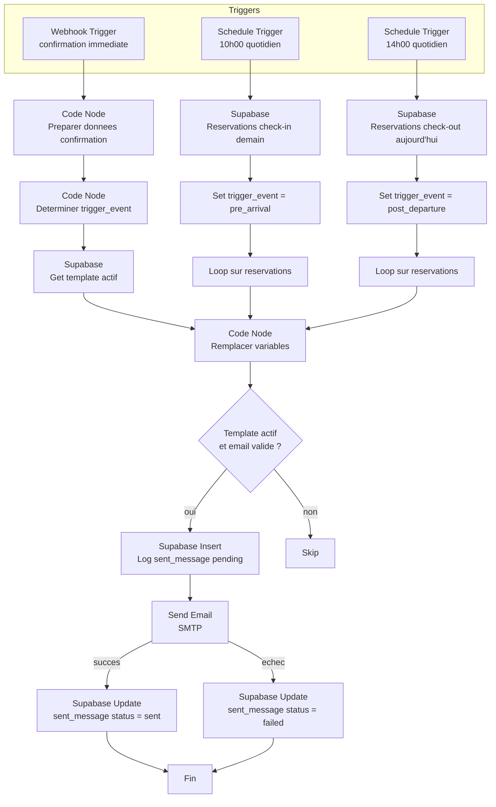

# WF05 -- Messages automatiques voyageurs

> Workflow d'envoi de messages automatiques aux voyageurs (confirmation, pre-arrivee, post-depart)
> Dashboard Loc Immo | Version : 1.0 | Date : 2026-02-12

---

## 1. Vue d'ensemble

### 1.1 Objectif

Envoyer automatiquement des emails personnalises aux voyageurs a trois moments cles :
1. **Confirmation** : immediatement apres la creation d'une nouvelle reservation (appele par WF01)
2. **Pre-arrivee** : la veille du check-in (J-1 a 10h00)
3. **Post-depart** : le jour du check-out (J+0 a 14h00)

Les templates de messages sont configurables par le proprietaire dans le dashboard (`/dashboard/settings`). Le systeme utilise des variables dynamiques remplacees automatiquement.

### 1.2 Variables dynamiques disponibles

| Variable | Description | Exemple |
|----------|-------------|---------|
| `{guest_name}` | Nom du voyageur | Jean Dupont |
| `{property_name}` | Nom de la propriete | Villa Sidi Kaouki |
| `{check_in}` | Date d'arrivee (format francais) | 15 mars 2026 |
| `{check_out}` | Date de depart (format francais) | 18 mars 2026 |
| `{welcome_link}` | Lien vers le livret d'accueil | https://app.locimmo.fr/welcome/uuid |
| `{checkin_form_link}` | Lien vers le formulaire pre-arrivee | https://app.locimmo.fr/checkin/token |
| `{access_code}` | Code d'acces du logement | A1B2C3 |

### 1.3 Triggers multiples

Ce workflow est declenche de trois manieres differentes :

| Flow | Trigger | Horaire |
|------|---------|---------|
| **Flow A** — Confirmation | Webhook (appele par WF01) | Immediat |
| **Flow B** — Pre-arrivee | Schedule Trigger | Quotidien a 10h00 CET |
| **Flow C** — Post-depart | Schedule Trigger | Quotidien a 14h00 CET |

> **Implementation n8n** : Comme un workflow ne peut avoir qu'un seul trigger, il y a deux options :
> 1. **Option A** : Trois workflows separes (WF05a, WF05b, WF05c) qui partagent un sub-workflow commun d'envoi
> 2. **Option B** : Un seul workflow avec un Webhook trigger + un Schedule trigger (n8n supporte les triggers multiples)
>
> **Recommandation** : Option B (workflow unique) pour la simplicite de maintenance.

### 1.4 Diagramme du workflow



---

## 2. Flow A -- Message de confirmation

### 2.1 Trigger : Webhook

| Parametre | Valeur |
|-----------|--------|
| **Type** | Webhook |
| **Method** | POST |
| **Path** | `/wf05-auto-message` |
| **Response** | Immediately (200 OK) |

### 2.2 Payload d'entree

Appele par WF01 apres creation d'une reservation :

```json
{
  "triggerType": "confirmation",
  "reservationId": "uuid",
  "propertyId": "uuid",
  "guestName": "Jean Dupont",
  "guestEmail": "jean.dupont@email.com",
  "checkIn": "2026-03-15",
  "checkOut": "2026-03-18"
}
```

### 2.3 Etapes

1. **Supabase** : Get la propriete (pour `access_code`, `name`, `owner_id`)
2. **Supabase** : Get la reservation complete (pour `checkin_token`)
3. **Supabase** : Get le template actif pour `trigger_event = 'confirmation'` et `owner_id`
4. **Code Node** : Remplacer les variables (voir section 5)
5. **Supabase Insert** : Creer un enregistrement `sent_messages` avec `status = 'pending'`
6. **Send Email** : Envoyer via SMTP
7. **Supabase Update** : Mettre a jour `status = 'sent'` et `sent_at = now()`, ou `status = 'failed'` + `error_message`

---

## 3. Flow B -- Message pre-arrivee (J-1)

### 3.1 Trigger : Schedule

| Parametre | Valeur |
|-----------|--------|
| **Type** | Schedule Trigger |
| **Expression** | `0 10 * * *` (quotidien a 10h00) |
| **Timezone** | `Europe/Paris` |

### 3.2 Etapes

1. **Supabase** : Get les reservations avec `check_in = demain` et `status` != `cancelled`

```
Filtre : check_in = DATE(NOW() + INTERVAL '1 day')
         AND status NOT IN ('cancelled', 'no_show')
```

2. **Loop** : Pour chaque reservation
3. **Supabase** : Verifier qu'un message `pre_arrival` n'a pas deja ete envoye pour cette reservation

```
Filtre : reservation_id = X
         AND template.trigger_event = 'pre_arrival'
         AND status = 'sent'
```

> Cette verification evite les doublons si le workflow est execute plusieurs fois le meme jour.

4. **Supabase** : Get le template actif `pre_arrival` pour le owner de la propriete
5. **Supabase** : Get les details de la propriete et du voyageur
6. **Code Node** : Remplacer les variables (inclure `{welcome_link}` et `{checkin_form_link}`)
7. **Supabase Insert** : Log `sent_messages` (pending)
8. **Send Email** via SMTP
9. **Supabase Update** : Mettre a jour le statut

### 3.3 Specificites pre-arrivee

Le message de pre-arrivee est le plus important car il contient :
- Le lien vers le **livret d'accueil** (`{welcome_link}`)
- Le lien vers le **formulaire pre-arrivee** (`{checkin_form_link}`)
- Le code d'acces (`{access_code}`)

Exemple de template par defaut :

```
Objet : Bienvenue — votre arrivee a {property_name} demain

Bonjour {guest_name},

Votre arrivee a {property_name} est prevue pour demain ({check_in}).

Pour preparer votre sejour, voici quelques informations utiles :

- Livret d'accueil : {welcome_link}
- Formulaire pre-arrivee (heure d'arrivee, demandes speciales) : {checkin_form_link}
- Code d'acces : {access_code}

N'hesitez pas a nous contacter si vous avez des questions.

Bon voyage !
```

---

## 4. Flow C -- Message post-depart

### 4.1 Trigger : Schedule

| Parametre | Valeur |
|-----------|--------|
| **Type** | Schedule Trigger |
| **Expression** | `0 14 * * *` (quotidien a 14h00) |
| **Timezone** | `Europe/Paris` |

### 4.2 Etapes

1. **Supabase** : Get les reservations avec `check_out = aujourd'hui` et `status` != `cancelled`

```
Filtre : check_out = DATE(NOW())
         AND status NOT IN ('cancelled', 'no_show')
```

2. **Loop** : Pour chaque reservation
3. **Supabase** : Verifier qu'un message `post_departure` n'a pas deja ete envoye
4. **Supabase** : Get le template actif `post_departure`
5. **Code Node** : Remplacer les variables
6. **Log + envoi + mise a jour** : idem Flow A et B

### 4.3 Specificites post-depart

L'horaire de 14h00 est choisi pour laisser le temps au voyageur de quitter le logement (check-out generalement entre 10h et 12h).

Exemple de template par defaut :

```
Objet : Merci pour votre sejour a {property_name}

Bonjour {guest_name},

Nous esperons que votre sejour a {property_name} ({check_in} - {check_out}) s'est bien deroule.

N'hesitez pas a laisser un avis sur la plateforme de reservation.

Merci et a bientot !
```

---

## 5. Remplacement des variables

### 5.1 Code Node -- Remplacement

```javascript
// ============================================================
// WF05 — Remplacer les variables dynamiques dans le template
// ============================================================

const template = $input.first().json;
const reservation = $node['Get reservation'].json;
const property = $node['Get propriete'].json;
const guest = $node['Get guest'].json || {};

// Construire les URLs
const dashboardUrl = $env.DASHBOARD_URL;
const welcomeLink = `${dashboardUrl}/welcome/${property.id}`;
const checkinFormLink = reservation.checkin_token
  ? `${dashboardUrl}/checkin/${reservation.checkin_token}`
  : '';

// Formater les dates en francais
function formatDateFR(dateStr) {
  const date = new Date(dateStr + 'T00:00:00');
  return date.toLocaleDateString('fr-FR', {
    day: 'numeric',
    month: 'long',
    year: 'numeric',
  });
}

// Map des variables
const variables = {
  '{guest_name}': guest.full_name || reservation.guest_name || 'Voyageur',
  '{property_name}': property.name || '',
  '{check_in}': formatDateFR(reservation.check_in),
  '{check_out}': formatDateFR(reservation.check_out),
  '{welcome_link}': welcomeLink,
  '{checkin_form_link}': checkinFormLink,
  '{access_code}': property.access_code || '[code non renseigne]',
};

// Remplacer dans le sujet et le body
let subject = template.subject || '';
let body = template.body || '';

for (const [variable, value] of Object.entries(variables)) {
  subject = subject.replaceAll(variable, value);
  body = body.replaceAll(variable, value);
}

// Convertir les sauts de ligne en <br> pour le HTML
const htmlBody = body
  .replace(/&/g, '&amp;')
  .replace(/</g, '&lt;')
  .replace(/>/g, '&gt;')
  .replace(/\n/g, '<br>');

return [{
  recipientEmail: guest.email || reservation.guest_email || null,
  subject,
  body,
  htmlBody: `
    <div style="font-family: -apple-system, sans-serif; max-width: 600px; margin: 0 auto; line-height: 1.6;">
      ${htmlBody}
    </div>
  `,
  reservationId: reservation.id,
  templateId: template.id,
  hasRecipientEmail: !!(guest.email || reservation.guest_email),
}];
```

### 5.2 Verification de l'email destinataire

Avant l'envoi, on verifie que le voyageur a une adresse email :
- Si `guestEmail` est disponible (extrait de l'email de confirmation) -> utiliser
- Si `guest.email` est disponible en base -> utiliser
- Si aucun email n'est disponible -> **skip** et logger `status = 'failed'` avec `error_message = 'Adresse email du voyageur non disponible'`

---

## 6. Logging dans sent_messages

### 6.1 Insert initial (pending)

```json
{
  "reservation_id": "uuid",
  "template_id": "uuid",
  "channel": "email",
  "recipient_email": "jean.dupont@email.com",
  "status": "pending"
}
```

### 6.2 Update apres envoi (succes)

```json
{
  "status": "sent",
  "sent_at": "2026-03-14T10:00:05Z"
}
```

### 6.3 Update apres envoi (echec)

```json
{
  "status": "failed",
  "error_message": "SMTP connection refused"
}
```

---

## 7. Gestion des erreurs

### 7.1 Template inactif ou inexistant

Si le proprietaire n'a pas configure de template pour un trigger_event donne (ou si `is_active = false`) :
- Le message n'est **pas envoye**
- Aucune erreur n'est levee
- Aucun log dans `sent_messages`

Ceci est un comportement normal : le proprietaire choisit quels messages activer.

### 7.2 Email du voyageur manquant

- Logging dans `sent_messages` avec `status = 'failed'` et `error_message = 'Email voyageur non disponible'`
- Pas d'alerte au proprietaire (le parsing d'email n'extrait pas toujours l'email du voyageur)

### 7.3 Echec SMTP

- Retry : 2 tentatives, delai 10 secondes
- Si echec apres retries : `status = 'failed'` avec le message d'erreur SMTP
- Email d'alerte au proprietaire :

```javascript
return [{
  to: $env.OWNER_EMAIL,
  subject: '[Loc Immo] Echec envoi message voyageur',
  body: `L'envoi d'un message automatique a echoue.\n\n` +
    `Type : ${triggerEvent}\n` +
    `Voyageur : ${guestName}\n` +
    `Email : ${recipientEmail}\n` +
    `Erreur : ${errorMessage}\n\n` +
    `Vous pouvez renvoyer le message manuellement depuis le dashboard.`,
}];
```

### 7.4 Deduplication

Pour eviter l'envoi en double (par exemple si le cron s'execute deux fois) :
- Avant chaque envoi, verifier dans `sent_messages` si un message du meme type a deja ete envoye pour cette reservation avec `status = 'sent'`
- Si oui, **skip** sans erreur

---

## 8. Configuration dans le dashboard

Le proprietaire configure ses templates dans `/dashboard/settings` :

| Champ | Description |
|-------|-------------|
| **Trigger** | `confirmation` / `pre_arrival` / `post_departure` |
| **Sujet** | Sujet de l'email (avec variables) |
| **Corps** | Corps du message (avec variables) |
| **Actif** | Toggle on/off |

### 8.1 Templates par defaut

Lors de la premiere connexion, proposer des templates par defaut :

**Confirmation** :
```
Sujet : Confirmation de votre reservation a {property_name}
Corps :
Bonjour {guest_name},

Votre reservation a {property_name} est confirmee pour les dates suivantes :
- Arrivee : {check_in}
- Depart : {check_out}

Nous vous enverrons toutes les informations pratiques la veille de votre arrivee.

A bientot !
```

**Pre-arrivee** :
```
Sujet : Bienvenue — votre arrivee a {property_name} demain
Corps :
Bonjour {guest_name},

Votre arrivee a {property_name} est prevue pour demain ({check_in}).

Voici les informations pour votre sejour :
- Livret d'accueil (adresse, wifi, regles) : {welcome_link}
- Formulaire pre-arrivee : {checkin_form_link}
- Code d'acces : {access_code}

N'hesitez pas a nous contacter si vous avez des questions.

Bon voyage !
```

**Post-depart** :
```
Sujet : Merci pour votre sejour a {property_name}
Corps :
Bonjour {guest_name},

Nous esperons que votre sejour a {property_name} du {check_in} au {check_out} s'est bien deroule.

Si vous avez apprecie votre experience, nous serions ravis que vous laissiez un avis sur la plateforme de reservation.

Merci et a bientot !
```

---

## 9. Evolution Phase 2

| Fonctionnalite | Description |
|----------------|-------------|
| WhatsApp (F13) | Envoi via l'API WhatsApp Business en plus de l'email |
| Templates multi-langues | Detection de la langue du voyageur et templates traduits |
| Preview en temps reel | Apercu du message avec variables remplacees dans le dashboard |
| Envoi manuel | Possibilite de renvoyer un message manuellement depuis la fiche reservation |
| A/B Testing | Tester differentes versions de messages |

---

*Document genere le 2026-02-12 -- Pipeline B04-Automations / WF05*
