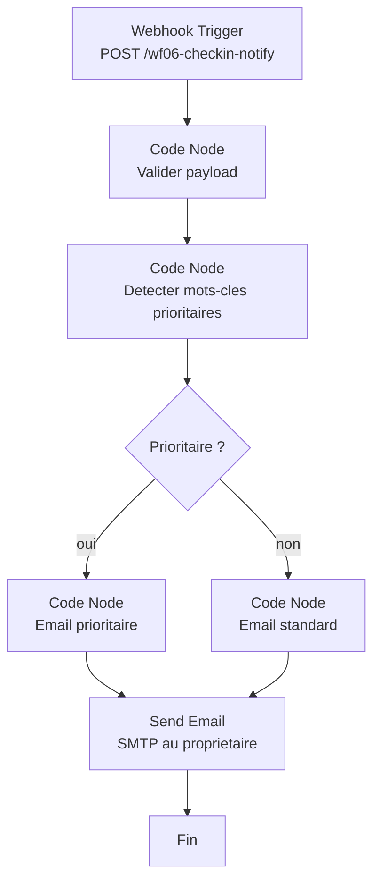

# WF06 -- Notification formulaire pre-arrivee

> Workflow de notification au proprietaire quand un voyageur soumet le formulaire pre-arrivee
> Dashboard Loc Immo | Version : 1.0 | Date : 2026-02-12

---

## 1. Vue d'ensemble

### 1.1 Objectif

Notifier le proprietaire par email lorsqu'un voyageur soumet le formulaire de pre-arrivee (`/checkin/[token]`). Si le voyageur formule des demandes speciales necessitant une attention particuliere (lit bebe, arrivee tardive, etc.), le message est marque comme prioritaire.

### 1.2 Trigger

| Parametre | Valeur |
|-----------|--------|
| **Type** | Webhook |
| **Method** | POST |
| **Path** | `/wf06-checkin-notify` |
| **Response** | Immediately (200 OK) |
| **Authentication** | Header Auth (`API Key - Dashboard`) |

> **Note** : Ce webhook est appele par l'application Next.js (Server Action) apres la soumission du formulaire, contrairement aux autres webhooks internes. Il utilise donc l'authentification par API Key.

### 1.3 Diagramme du workflow



---

## 2. Payload d'entree

Appele par l'application Next.js apres soumission du formulaire :

```json
{
  "reservationId": "uuid",
  "guestName": "Jean Dupont",
  "propertyName": "Villa Sidi Kaouki",
  "propertyId": "uuid",
  "checkIn": "2026-03-15",
  "checkOut": "2026-03-18",
  "arrivalTime": "15:00",
  "specialRequests": "Nous arrivons avec un bebe, est-il possible d'avoir un lit bebe ?",
  "nbGuests": 2
}
```

---

## 3. Configuration des nodes

### 3.1 Node 1 : Webhook Trigger

| Parametre | Valeur |
|-----------|--------|
| **Nom** | `Formulaire pre-arrivee soumis` |
| **HTTP Method** | POST |
| **Path** | `wf06-checkin-notify` |
| **Response Mode** | Immediately |
| **Response Code** | 200 |
| **Authentication** | Header Auth |
| **Credential** | `API Key - Dashboard` |

### 3.2 Node 2 : Code Node -- Validation

```javascript
// Valider le payload
const data = $input.first().json;

if (!data.reservationId || !data.guestName || !data.propertyName) {
  throw new Error('Payload invalide : reservationId, guestName et propertyName sont requis');
}

return [{
  ...data,
  arrivalTime: data.arrivalTime || 'non renseignee',
  specialRequests: data.specialRequests || null,
  nbGuests: data.nbGuests || 1,
}];
```

### 3.3 Node 3 : Code Node -- Detection mots-cles prioritaires

```javascript
// ============================================================
// WF06 — Detection de mots-cles prioritaires dans les demandes speciales
// ============================================================

const data = $input.first().json;
const specialRequests = (data.specialRequests || '').toLowerCase();

// Mots-cles indiquant une demande prioritaire
const priorityKeywords = [
  // Enfants / bebes
  'bébé', 'bebe', 'bébés', 'bebes',
  'enfant', 'enfants',
  'lit bébé', 'lit bebe', 'lit enfant',
  'poussette',
  'chaise haute',

  // Arrivee tardive
  'tard', 'tardif', 'tardive',
  'late', 'arrivée tardive', 'arrivee tardive',
  'après 21h', 'apres 21h',
  'après 22h', 'apres 22h',
  'après minuit', 'apres minuit',

  // Handicap / accessibilite
  'handicap', 'handicapé', 'handicape',
  'fauteuil', 'fauteuil roulant',
  'mobilité réduite', 'mobilite reduite',
  'accessibilité', 'accessibilite',
  'pmr',

  // Animaux
  'animal', 'animaux',
  'chien', 'chat',
  'pet', 'dog', 'cat',

  // Problemes / urgences
  'problème', 'probleme',
  'urgence', 'urgent',
  'allergie', 'allergique',
];

const detectedKeywords = [];
for (const keyword of priorityKeywords) {
  if (specialRequests.includes(keyword)) {
    detectedKeywords.push(keyword);
  }
}

const isPriority = detectedKeywords.length > 0;

// Detecter aussi une arrivee tardive par l'heure
let lateArrival = false;
if (data.arrivalTime) {
  const hourMatch = data.arrivalTime.match(/(\d{1,2})/);
  if (hourMatch) {
    const hour = parseInt(hourMatch[1], 10);
    if (hour >= 21) {
      lateArrival = true;
      if (!detectedKeywords.includes('arrivée tardive')) {
        detectedKeywords.push('arrivée tardive (heure >= 21h)');
      }
    }
  }
}

return [{
  ...data,
  isPriority: isPriority || lateArrival,
  detectedKeywords,
  priorityReason: detectedKeywords.length > 0
    ? `Mots-cles detectes : ${detectedKeywords.join(', ')}`
    : null,
}];
```

### 3.4 Node 4 : IF (prioritaire ?)

| Parametre | Valeur |
|-----------|--------|
| **Condition** | `{{ $json.isPriority }}` = `true` |

### 3.5 Nodes 5a/5b : Code Node -- Construire email

**Email prioritaire** :

```javascript
const data = $input.first().json;

const subject = `[PRIORITE] Formulaire pre-arrivee — ${data.guestName} @ ${data.propertyName}`;

const html = `
<div style="font-family: -apple-system, sans-serif; max-width: 600px; margin: 0 auto;">
  <div style="background: #fef2f2; border: 2px solid #dc2626; border-radius: 8px; padding: 16px; margin-bottom: 16px;">
    <h2 style="color: #dc2626; margin: 0 0 8px 0;">ATTENTION REQUISE</h2>
    <p style="color: #991b1b; margin: 0;">${data.priorityReason}</p>
  </div>

  <h2 style="color: #1a1a2e;">Formulaire pre-arrivee soumis</h2>

  <table border="0" cellpadding="8" style="width: 100%; border-collapse: collapse;">
    <tr style="border-bottom: 1px solid #e5e7eb;">
      <td style="color: #6b7280;"><strong>Voyageur</strong></td>
      <td>${data.guestName}</td>
    </tr>
    <tr style="border-bottom: 1px solid #e5e7eb;">
      <td style="color: #6b7280;"><strong>Propriete</strong></td>
      <td>${data.propertyName}</td>
    </tr>
    <tr style="border-bottom: 1px solid #e5e7eb;">
      <td style="color: #6b7280;"><strong>Dates</strong></td>
      <td>${data.checkIn} -> ${data.checkOut}</td>
    </tr>
    <tr style="border-bottom: 1px solid #e5e7eb;">
      <td style="color: #6b7280;"><strong>Nb voyageurs</strong></td>
      <td>${data.nbGuests}</td>
    </tr>
    <tr style="border-bottom: 1px solid #e5e7eb;">
      <td style="color: #6b7280;"><strong>Heure d'arrivee</strong></td>
      <td><strong>${data.arrivalTime}</strong></td>
    </tr>
    <tr style="background: #fef3c7;">
      <td style="color: #6b7280;"><strong>Demandes speciales</strong></td>
      <td><strong>${data.specialRequests || '-'}</strong></td>
    </tr>
  </table>

  <div style="margin-top: 16px; text-align: center;">
    <a href="${$env.DASHBOARD_URL}/dashboard/reservations/${data.reservationId}"
       style="display: inline-block; padding: 12px 24px; background: #dc2626;
              color: white; text-decoration: none; border-radius: 8px;">
      Voir la reservation
    </a>
  </div>
</div>`;

return [{
  to: $env.OWNER_EMAIL,
  subject,
  html,
}];
```

**Email standard** :

```javascript
const data = $input.first().json;

const subject = `Formulaire pre-arrivee — ${data.guestName} @ ${data.propertyName}`;

const html = `
<div style="font-family: -apple-system, sans-serif; max-width: 600px; margin: 0 auto;">
  <h2 style="color: #1a1a2e;">Formulaire pre-arrivee soumis</h2>

  <p>${data.guestName} a rempli le formulaire de pre-arrivee pour
     <strong>${data.propertyName}</strong>.</p>

  <table border="0" cellpadding="8" style="width: 100%; border-collapse: collapse;">
    <tr style="border-bottom: 1px solid #e5e7eb;">
      <td style="color: #6b7280;"><strong>Dates</strong></td>
      <td>${data.checkIn} -> ${data.checkOut}</td>
    </tr>
    <tr style="border-bottom: 1px solid #e5e7eb;">
      <td style="color: #6b7280;"><strong>Nb voyageurs</strong></td>
      <td>${data.nbGuests}</td>
    </tr>
    <tr style="border-bottom: 1px solid #e5e7eb;">
      <td style="color: #6b7280;"><strong>Heure d'arrivee</strong></td>
      <td>${data.arrivalTime}</td>
    </tr>
    <tr style="border-bottom: 1px solid #e5e7eb;">
      <td style="color: #6b7280;"><strong>Demandes speciales</strong></td>
      <td>${data.specialRequests || 'Aucune'}</td>
    </tr>
  </table>

  <div style="margin-top: 16px; text-align: center;">
    <a href="${$env.DASHBOARD_URL}/dashboard/reservations/${data.reservationId}"
       style="display: inline-block; padding: 12px 24px; background: #3b82f6;
              color: white; text-decoration: none; border-radius: 8px;">
      Voir la reservation
    </a>
  </div>
</div>`;

return [{
  to: $env.OWNER_EMAIL,
  subject,
  html,
}];
```

### 3.6 Node 6 : Send Email

| Parametre | Valeur |
|-----------|--------|
| **Nom** | `Email proprietaire` |
| **Credential** | `SMTP - Loc Immo` |
| **To** | `{{ $json.to }}` |
| **Subject** | `{{ $json.subject }}` |
| **HTML** | `{{ $json.html }}` |
| **From Name** | `Loc Immo` |
| **Retry on Fail** | Oui, 2 retries |

---

## 4. Integration avec l'application Next.js

### 4.1 Appel du webhook depuis le Server Action

Le formulaire pre-arrivee (`/checkin/[token]`) declenche un Server Action qui, apres mise a jour de la reservation en base, appelle ce webhook :

```typescript
// Pseudocode - Server Action du formulaire pre-arrivee
'use server';

export async function submitCheckinForm(token: string, input: CheckinFormInput) {
  // 1. Mettre a jour la reservation en base
  // ... (update arrival_time, special_requests, status)

  // 2. Notifier le proprietaire via WF06
  try {
    await fetch(`${process.env.N8N_WEBHOOK_URL}/wf06-checkin-notify`, {
      method: 'POST',
      headers: {
        'Content-Type': 'application/json',
        'x-api-key': process.env.N8N_WEBHOOK_API_KEY!,
      },
      body: JSON.stringify({
        reservationId: reservation.id,
        guestName: guest.full_name,
        propertyName: property.name,
        propertyId: property.id,
        checkIn: reservation.check_in,
        checkOut: reservation.check_out,
        arrivalTime: input.arrivalTime,
        specialRequests: input.specialRequests,
        nbGuests: reservation.nb_guests,
      }),
    });
  } catch (error) {
    // Ne pas bloquer la soumission du formulaire si la notification echoue
    console.error('[checkin-form] Notification WF06 failed:', error);
  }
}
```

> **Important** : L'appel au webhook est fait dans un `try/catch` pour ne pas bloquer la soumission du formulaire en cas d'echec de la notification.

---

## 5. Gestion des erreurs

### 5.1 Webhook non accessible

Si n8n est temporairement indisponible, l'application Next.js catch l'erreur et la logue. La soumission du formulaire est quand meme effectuee en base. Le proprietaire verra les informations dans le dashboard meme s'il ne recoit pas la notification email.

### 5.2 Echec envoi email

- Retry SMTP : 2 tentatives, delai 5 secondes
- Si echec : log dans la console n8n
- Le proprietaire peut consulter les formulaires soumis directement dans le dashboard

### 5.3 Error Trigger

```javascript
return [{
  to: $env.OWNER_EMAIL,
  subject: '[Loc Immo] ERREUR - WF06 Notification pre-arrivee',
  body: `Le workflow de notification pre-arrivee a echoue.\n\n` +
    `Erreur : ${$json.error?.message || 'Inconnue'}\n` +
    `Heure : ${new Date().toISOString()}\n\n` +
    `Un voyageur a peut-etre soumis un formulaire pre-arrivee ` +
    `sans que vous soyez notifie. Verifiez le dashboard.`,
}];
```

---

## 6. Evolution Phase 2

| Fonctionnalite | Description |
|----------------|-------------|
| Notification push | Envoyer une notification push en plus de l'email |
| Notification staff | Notifier aussi le staff assigne si la demande impacte le menage |
| Reponse automatique | Repondre automatiquement au voyageur (ex: "Lit bebe disponible") |
| Historique notifications | Stocker les notifications en base pour consultation dans le dashboard |

---

*Document genere le 2026-02-12 -- Pipeline B04-Automations / WF06*
